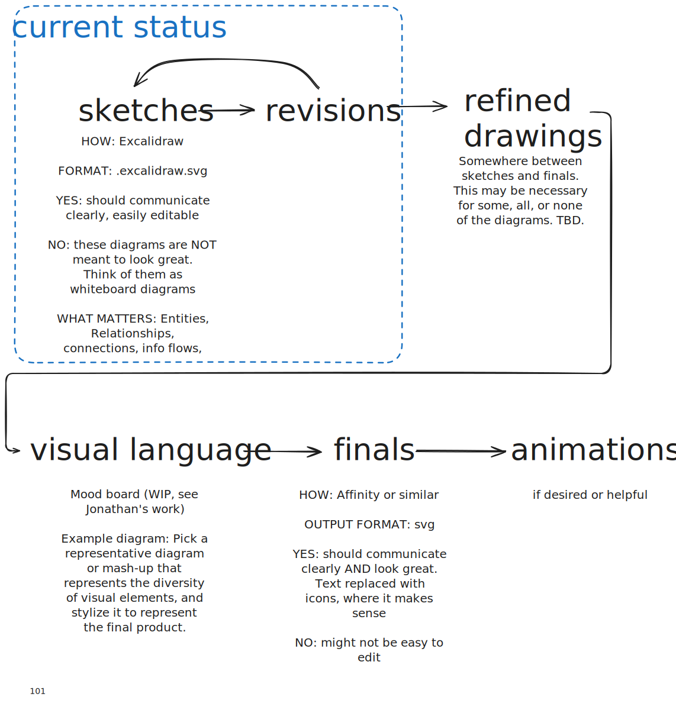
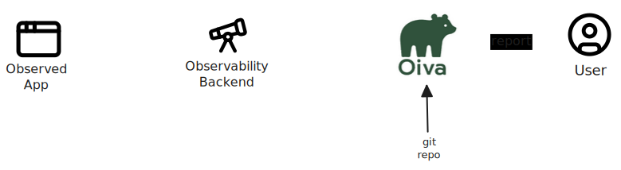
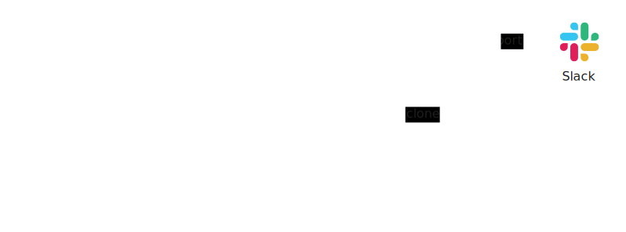
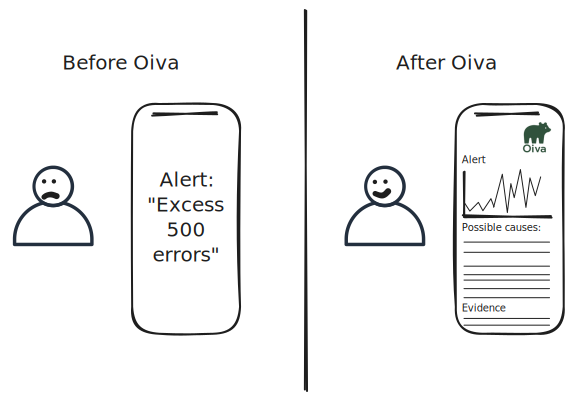
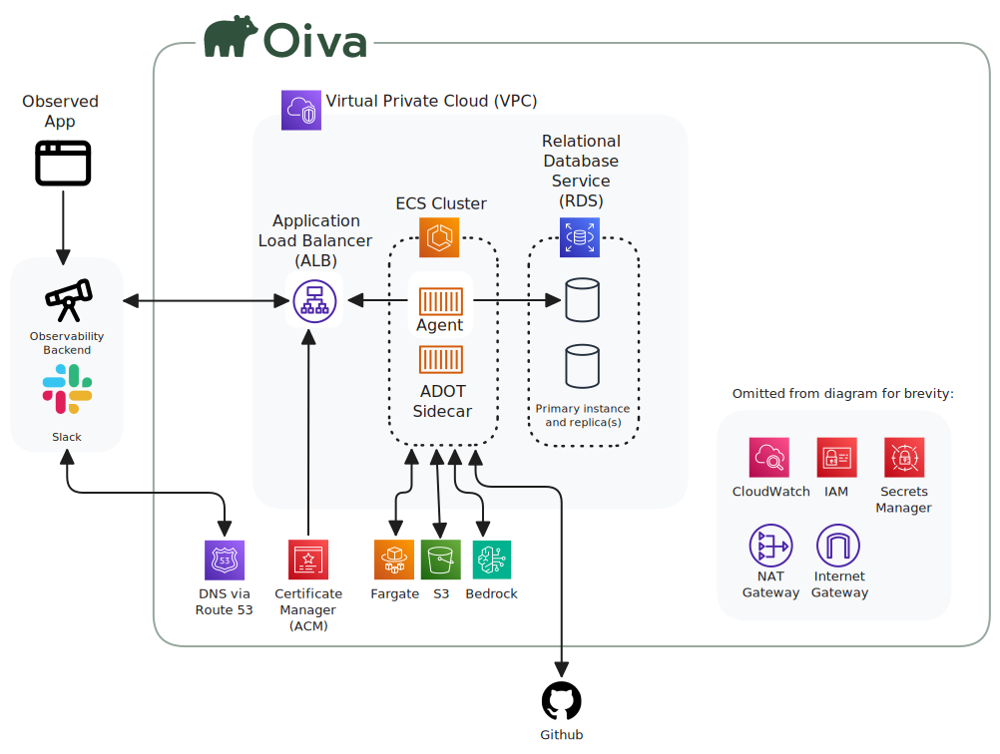
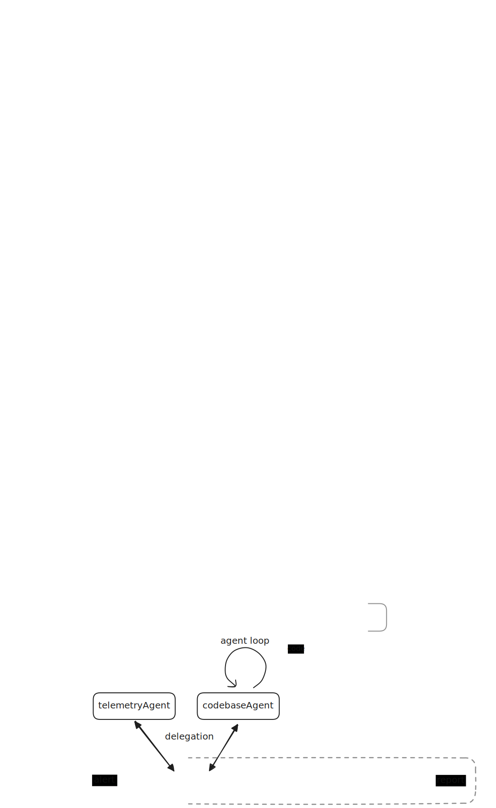

## meta
About the diagrams and diagramming process

## overview
A vendor agnostic overview of Oiva

Our currently implementation

## System Archtecture

Here's the full diagram, with all the gory details.  Simplified diagrams will be created as necessary for clear communication.

Idea: animate from least complex to most complex?

## Agent Architecture

### Improving telAgent performance

